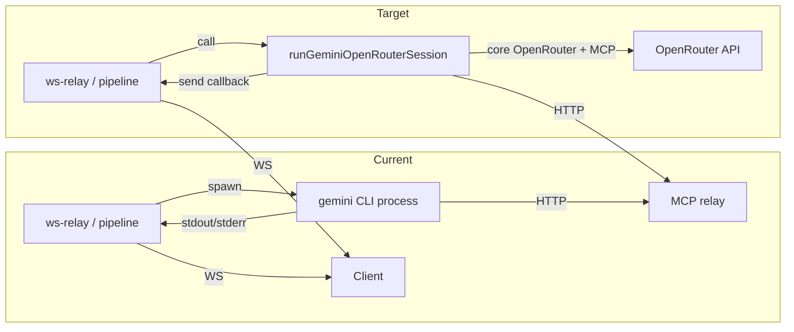

# Plan: Clone gemini-cli-openrouter and use its code for streaming tokens and tool calls via TypeScript

## Current state

- **CLI-only usage**: The project runs [@chameleon-nexus-tech/gemini-cli-openrouter](https://www.npmjs.com/package/@chameleon-nexus-tech/gemini-cli-openrouter) as a **subprocess** from:
  - [mcp/agents/top_dog/src/ws-relay.ts](mcp/agents/top_dog/src/ws-relay.ts) — `runAgentViaCLIWs()` (single-agent runs)
  - [mcp/agents/top_dog/src/pipeline/graph.ts](mcp/agents/top_dog/src/pipeline/graph.ts) — `spawnGeminiCli()` (planner + executor phases)
- **Token counts**: When using the CLI, the relay **estimates** tokens with `Math.ceil(text.length / 4)` ([ws-relay.ts ~1029](mcp/agents/top_dog/src/ws-relay.ts)); real usage from the API is not available.
- **Streaming**: Stdout is parsed line-by-line and filtered ([CLIOutputFilter](mcp/agents/top_dog/src/cli-gemini.ts)); stderr is only used for 402/429 error detection. No structured `turn_complete` with real `prompt_tokens`/`completion_tokens` is sent for the CLI path.
- **Tool calls**: MCP tool execution is unchanged—the CLI (or a future in-process driver) still talks to the existing HTTP relay (`/mcp?connId=...`), so the WS protocol (`tool_call_request` / `tool_call_result`) stays the same.

## Target state

- **Clone** [chameleon-nexus/gemini-cli-openrouter](https://github.com/chameleon-nexus/gemini-cli-openrouter) into the repo (e.g. as a git submodule or under `mcp/agents/top_dog/vendor/` or a sibling `third_party/`).
- **Use the fork’s code in-process**: Drive the same OpenRouter + MCP + tool loop from TypeScript (no CLI spawn). Emit:
  - **Streaming**: `agent_message_delta` (text chunks from the model).
  - **Tokens**: `turn_complete` with real `usage.prompt_tokens` and `usage.completion_tokens` from the OpenRouter API (and optional cost for credits).
  - **Tool calls**: Keep current WS flow (relay still sends `tool_call_request`; client executes and sends `tool_call_result`). Optionally emit `tool_call` / `agent_thinking` for UX (e.g. “Tool call: place_component”).
- **Invoke via TypeScript**: A single driver (e.g. `runGeminiOpenRouterSession()`) that both the WebSocket relay and the pipeline can call with `{ model, prompt, mcpBaseUrl, send(msg) }`, so all Gemini/OpenRouter runs are programmatic.

## Key files in gemini-cli-openrouter (from repo README and layout)

- **packages/core**: `@google/gemini-cli-core` (monorepo package name). Contains:
  - `core/contentGenerator.ts`, `contentGeneratorFactory.ts`, **openrouterContentGenerator.ts** — OpenRouter adapter (streaming, token counting, function calling).
  - `core/coreToolScheduler.ts` — tool execution and function calling.
  - `mcp/` — MCP client integration.
  - `index.ts` — main core exports; CLI uses this to run the chat loop.
- **packages/cli**: Entry that parses argv, reads config, and calls into core. We will **not** run the CLI binary; we will depend on **core** and implement a thin “session runner” that uses the same content generator + MCP + tool scheduler.

## Implementation outline

### 1. Clone and wire the fork

- Add the repo as a **git submodule** under e.g. `mcp/agents/top_dog/gemini-cli-openrouter` (or clone into `vendor/gemini-cli-openrouter` and document in README). Use a fixed ref/tag if available for reproducibility.
- In the fork, ensure **packages/core** builds (e.g. `npm run build` at repo root or in `packages/core`). The core package name is `@google/gemini-cli-core` and has many dependencies (see its `package.json`); the top-level monorepo likely uses workspaces.
- Add a dependency from top_dog to the local core package:
  - **Option A**: `"@google/gemini-cli-core": "file:./gemini-cli-openrouter/packages/core"` (or path to built `dist`).
  - **Option B**: Build the fork’s bundle and don’t depend on core as a package; instead copy or reimplement only the OpenRouter HTTP + streaming + tool-call handling in top_dog (larger duplication, fewer fork dependencies). Prefer **Option A** if the fork’s core exports are usable.

### 2. Identify the programmatic entry point in core

- In the cloned repo, trace how the **CLI** starts a session (e.g. `packages/cli/index.ts` and `src/main.ts` or similar). The CLI will:
  - Load config (e.g. `.gemini/settings.json`) for MCP server URLs.
  - Create a content generator (via factory → OpenRouter when `AI_ENGINE=openrouter`).
  - Run a chat loop: send user message → stream response → on tool calls, invoke MCP tools → append results and continue.
- Determine what core exports (e.g. a “session” or “chat” runner) accept: prompt, model, MCP client or MCP server list, and return or callback with: text deltas, tool-call requests, and usage (prompt_tokens, completion_tokens). If the core only exposes CLI-oriented APIs, add a **thin wrapper** in the fork (or in top_dog) that:
  - Instantiates the OpenRouter content generator with `OPENROUTER_API_KEY` and model.
  - Uses the existing MCP client from core (configured with the same relay URL as today: `http://MCP_RELAY_HOST:WS_PORT/mcp?connId=...`).
  - Runs the loop and maps internal events to our WS message types.

### 3. TypeScript driver in top_dog

- Add a new module, e.g. [mcp/agents/top_dog/src/gemini-openrouter-session.ts](mcp/agents/top_dog/src/gemini-openrouter-session.ts) (or under `src/pipeline/` if only used there first).
- **Interface**: `runGeminiOpenRouterSession(options)` where options include:
  - `model: string` (e.g. `google/gemini-3-flash-preview`)
  - `prompt: string`
  - `mcpRelayUrl: string` (e.g. `http://localhost:3000/mcp?connId=1`)
  - `send: (msg: WsMessage) => void` — callback for every message to send to the client (e.g. `agent_message_delta`, `agent_thinking`, `turn_complete`, `tool_call`, `tool_call_request` if we proxy, `agent_complete`, `error`)
  - `signal?: AbortSignal`
  - Optional `cwd` or workspace path if core needs it for config/tools.
- **Behavior**:
  - Use core’s OpenRouter content generator and tool scheduler; on each streamed chunk, call `send({ type: "agent_message_delta", text })`.
  - On each tool call: either (1) delegate to existing relay so the client gets `tool_call_request` and sends `tool_call_result` (current design), or (2) call MCP from this process and forward results; either way, emit `tool_call` and optional `agent_thinking` for UX.
  - On turn/token usage from the API, call `send({ type: "turn_complete", usage: { prompt_tokens, completion_tokens } })`; optionally compute cost and pass to credits.
  - On session end, `send({ type: "agent_complete", agentName, toolCalls, exitCode })`.
- **MCP**: Ensure the in-process runner uses the **same** MCP endpoint as the current CLI (relay URL with `connId`). The relay already forwards to the client; we only change who is making the HTTP request to the relay (our process instead of the CLI process). No change to WS protocol for tool_call_request / tool_call_result.

### 4. Replace CLI spawn with the driver

- **ws-relay.ts**:
  - In `runAgentViaCLIWs`, when using Gemini/OpenRouter (non–Codex path), stop spawning `gemini` / `npx @chameleon-nexus-tech/gemini-cli-openrouter`; instead call `runGeminiOpenRouterSession({ model, prompt, mcpRelayUrl, send: (msg) => sendJson(ws, msg), signal })`. Keep the same session dir and `.gemini/settings.json` if core still reads them; otherwise pass relay URL explicitly.
  - Keep Codex path unchanged.
- **pipeline/graph.ts**:
  - Replace `spawnGeminiCli` with `runGeminiOpenRouterSession` for both planner and executor nodes. Pass the same `send`, `model`, `prompt`, and relay URL (with same `connId`/`wsPort` and optional `&role=planner`). Use the same `writeGeminiSettings`-equivalent MCP URL so tool filtering by role still works if the relay enforces it.
- **Credits/billing**: In the driver (or in the relay when it receives `turn_complete`), use real `usage.prompt_tokens` and `usage.completion_tokens` for `chargeForTurn` instead of the current char/4 estimate.

### 5. CLI fallback and compatibility

- Keep `getGeminiCLIInvocation()` and the CLI provider in [cli-provider.ts](mcp/agents/top_dog/src/cli-provider.ts) for environments where the in-process path is not used (e.g. optional env `USE_GEMINI_CLI=1` to force subprocess). Default to the TypeScript driver when the cloned core is available.
- Document in [top_dog README](mcp/agents/top_dog/README.md): how to clone and build gemini-cli-openrouter, and that the default is now programmatic OpenRouter with streaming tokens and tool calls.

### 6. Optional: local CLI for dev

- If developers still want to run `gemini` from the shell, they can install `@chameleon-nexus-tech/gemini-cli-openrouter` globally or use the cloned repo’s CLI; no change required for that. The in-process path is additive.

## Risks and mitigations

- **Core API surface**: The fork’s core may not export a “run session with callbacks” API; it might be CLI-centric. Mitigation: implement a minimal loop in top_dog that uses only the OpenRouter HTTP client and the MCP client from core (or from `@modelcontextprotocol/sdk`), and replicate the tool-call loop so we don’t depend on undocumented internals. That implies optionally depending only on the OpenRouter streaming + token usage from the fork (e.g. `openrouterContentGenerator`) and implementing the rest with MCP SDK.
- **Dependency bloat**: Core has many dependencies (OpenTelemetry, Google libs, etc.). Mitigation: use a workspace/file dependency and tree-shake or depend only on the minimal set (e.g. a dedicated “openrouter-runner” in the fork that re-exports only what we need).
- **Docker**: The Dockerfile today installs the npm package and applies sed patches. After switching to the driver, either (1) remove the global gemini-cli install and build the cloned core inside the image, or (2) keep the npm package for the fallback CLI and add the clone only when building the TypeScript driver path.

## Summary diagram

## Todos (high level)

- Clone gemini-cli-openrouter (submodule or vendor), build core, add top_dog dependency.
- Implement or adopt a programmatic session API (core or thin wrapper) that streams text, tool calls, and token usage.
- Add `runGeminiOpenRouterSession` in top_dog and wire it to the existing WS message types.
- Replace CLI spawn in ws-relay and pipeline/graph with the driver; use real usage for credits.
- Keep CLI fallback via env and document the new default.