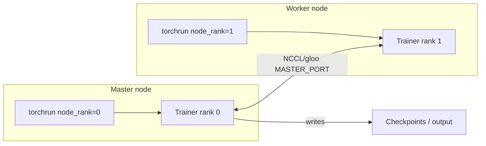

# Distributed Training (DDP) and Docker

The trainer supports **PyTorch Distributed Data Parallel (DDP)** so you can run a single training job across multiple GPUs (one or multiple nodes). Checkpoints and metrics are written only by rank 0.

## 1. Single-node multi-GPU

From the repo root (`pcb_ft_q35`):

```bash
# 2 GPUs on this machine; effective batch size = batch_size * 2
NPROC_PER_NODE=2 ./scripts/train_ddp.sh
```

Or with `torchrun` directly:

```bash
torchrun --nproc_per_node=2 -m src.train.train_qwen35_graph \
  --model Qwen/Qwen3.5-0.8B --dataset data/geometry_tasks_split.jsonl \
  --output-dir output/run1 --freeze-decoder
```

Environment variables `RANK`, `WORLD_SIZE`, and `LOCAL_RANK` are set by `torchrun`; the trainer enters DDP mode automatically.

## 2. Multi-node (master + workers)

Same script and image on each machine; only env vars and `NODE_RANK` differ.

**Master node** (runs first; replace `MASTER_ADDR` with this host’s IP):

```bash
export MASTER_ADDR=192.168.1.100
export MASTER_PORT=29500
export NNODES=2
export NODE_RANK=0
export NPROC_PER_NODE=1
./scripts/train_ddp.sh
```

**Worker node** (same `MASTER_ADDR` / `MASTER_PORT`, different `NODE_RANK`):

```bash
export MASTER_ADDR=192.168.1.100
export MASTER_PORT=29500
export NNODES=2
export NODE_RANK=1
export NPROC_PER_NODE=1
./scripts/train_ddp.sh
```

Ensure firewall allows traffic on `MASTER_PORT` between nodes and that code/dataset (or paths) are consistent.

## 3. Docker training client

Build the image from the repo root:

```bash
docker build -t pcb-ft-q35-train -f Dockerfile .
```

Run a single-node training job with data and output mounted:

```bash
docker run --rm --gpus all \
  -v /path/to/your/data:/data \
  -v /path/to/your/output:/output \
  pcb-ft-q35-train \
  --model Qwen/Qwen3.5-0.8B \
  --dataset /data/geometry_tasks_split.jsonl \
  --output-dir /output/run1 \
  --freeze-decoder
```

For **two nodes** (e.g. master and worker on different hosts):

- **Master (terminal 1):**
  ```bash
  docker run --rm --gpus all \
    -e MASTER_ADDR=0.0.0.0 \
    -e MASTER_PORT=29500 \
    -e NNODES=2 \
    -e NODE_RANK=0 \
    -e NPROC_PER_NODE=1 \
    -v /path/to/data:/data \
    -v /path/to/output:/output \
    --network host \
    pcb-ft-q35-train \
    --model Qwen/Qwen3.5-0.8B \
    --dataset /data/geometry_tasks_split.jsonl \
    --output-dir /output/run1 \
    --freeze-decoder
  ```

- **Worker (terminal 2, set MASTER_ADDR to master’s IP):**
  ```bash
  docker run --rm --gpus all \
    -e MASTER_ADDR=192.168.1.100 \
    -e MASTER_PORT=29500 \
    -e NNODES=2 \
    -e NODE_RANK=1 \
    -e NPROC_PER_NODE=1 \
    -v /path/to/data:/data \
    -v /path/to/output:/output \
    --network host \
    pcb-ft-q35-train \
    --model Qwen/Qwen3.5-0.8B \
    --dataset /data/geometry_tasks_split.jsonl \
    --output-dir /output/run1 \
    --freeze-decoder
  ```

Using `--network host` lets containers use the host network so they can reach each other by the master’s IP. On a single host with two containers, you can use the host’s IP as `MASTER_ADDR` for the worker.

Optional helper that prints these commands and can start the master:

```bash
DATA_DIR=/path/to/data OUTPUT_DIR=/path/to/output ./scripts/docker-train.sh
```

## 4. Architecture (multi-node DDP)



- One process per GPU; each process runs the same trainer.
- `DistributedSampler` shards the training set across ranks; validation and checkpointing run only on rank 0.
- Effective batch size = `batch_size × world_size` (and optionally `× grad_accum`).

## 5. Base image

The Dockerfile uses **NVIDIA NGC PyTorch** (`nvcr.io/nvidia/pytorch:24.06-py3`) by default so NCCL works across nodes. For CPU-only (e.g. CI), build with:

```bash
docker build --build-arg PYTORCH_IMAGE=pytorch/pytorch:2.5.1-cpu -t pcb-ft-q35-train .
```

The trainer will use the `gloo` backend when CUDA is not available.
